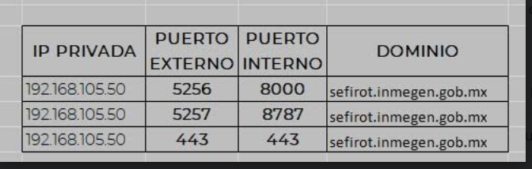

# Instrucciones mejoras del README.md

Primero debes de correr el contenedor con su volumen externo para que permanezan los cambios

```bash
sudo docker run --interactive --tty --name sc_lung --publish 8888-8892:8888-8892 --volume $HOME/2021-SC-HCA-LATAM/CONTAINER:/root/host_home --workdir /root/host_home/ leanderd/single-cell-analysis:211119 /bin/bash
```

O con con una imagen con tensorflow, nvida y pytorch y accesso a los datos del servidor sefirot

Yo must install the apt package `docker-nvidia` for the gpu flags to work.

```bash
docker run --interactive --runtime=nvidia --gpus all --tty --name sc_lung --publish 8888-8892:8888-8892 --volume $HOME/2021-SC-HCA-LATAM/CONTAINER:/root/host_home --volume /datos:/root/datos --workdir /root/host_home/ netopaas/sc_anal /bin/bash
```

Solo una vez debes de confiar en el notebook,
para poder correr todos los comandos y asgurate de que la version de ipython sea 7.20:

```bash
jupyter trust ~/host_home/single-cell-tutorial/latest_notebook/Case-study_Mouse-eintestinal-epithelium_2101.ipynb
pip install -U "ipython>=7.20"
```

Los cambios al notebook ya estan integrados en commits propios. Para poder empezar a trabajar con el notebook
debes de correr `jl`.

Para poder acceder al jl del server corriendo en un docker container:
`ssh -p <host port> -N -f -L <port you will acess from>:localhost:<remote port> sefirot.inmegen.gob.mx`

Estos son los mapeos de los ips del server, solo que el ssh es 5265


Pero si tienes el tunel abierto lo puedes cerrar buscando el proceso con `ps aux | grep ssh`
y matandolo con `kill <PID>`

El mejor es `lsof -ti :<PUERTO>`
